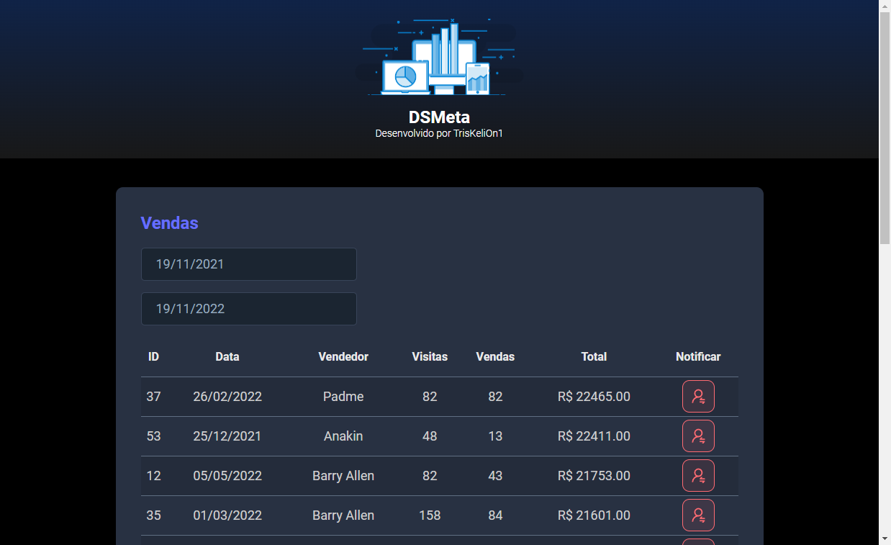

<h1 align="center"> DSMeta &#x1F4C8; </h1>

  <a href="#-tecnologias">Tecnologias</a>&nbsp;&nbsp;&nbsp;|&nbsp;&nbsp;&nbsp;
  <a href="#-projeto">Projeto</a>&nbsp;&nbsp;&nbsp;|&nbsp;&nbsp;&nbsp;
  <a href="#-layout">Layout</a>&nbsp;&nbsp;&nbsp;|&nbsp;&nbsp;&nbsp;

 
 

  

## 🚀 Tecnologias

Esse projeto foi desenvolvido com as seguintes tecnologias:

- HTML e CSS
- TypeScript
- React
- Hook in React (useEffect)
- Java
- SpringBoot
- API REST
- Axios
- H2 DB
- Heroku
- Twilio
- GitHub CLI
- Git e Github

## 💻 Projeto

O projeto tem a intenção de ser um controlador de listagem de vendas, sendo possível filtrar determinados períodos de vendas utilizando o calendário, e realizar o envio de SMS após a solicitação específica através do usuário.

## 🔖 Layout

Você pode visualizar o layout do projeto através [DESSE LINK](<https://www.figma.com/file/Yu2RHFmirHQ4BIVZM2XxY6/DSMeta2?node-id=0%3A1&t=ECibTMBI5lb0lham-0>). É necessário ter conta no [Figma](https://figma.com) para acessá-lo.

